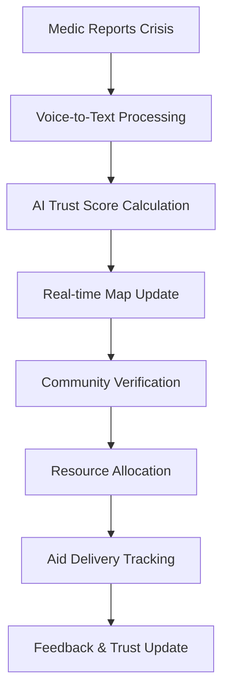
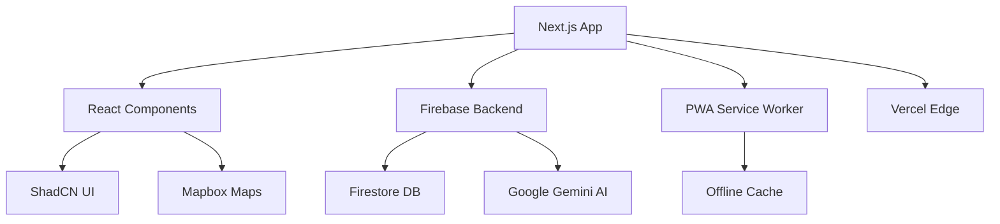

<div align="center">

# 🏥 Gaza Aid & Trust: Crisis Connect

### *AI-Powered Humanitarian Crisis Response Platform*

**Streamlining medical triage and aid distribution in crisis zones through technology, trust, and community.**

[](https://web.dev/progressive-web-apps/)
[](https://developers.google.com/web/fundamentals/instant-and-offline/offline-first)
[](https://developers.google.com/web/fundamentals/design-and-ux/responsive)
[](https://ai.google.dev/)


**🏆 Built for the "Hack for Gaza" Hackathon | 🎯 Addressing Critical Healthcare Challenges**

[🚀 Live Demo](#live-demo) • [📱 Install PWA](#pwa-installation) • [🛠️ Setup Guide](#getting-started) • [📖 Documentation](#documentation)

</div>

---

## 🌟 **Project Highlights**

<div align="center">

| 🎯 **Challenge** | 🚀 **Solution** | 💡 **Innovation** |
|:---:|:---:|:---:|
| **Crisis Response** | Real-time triage mapping | AI-powered trust scoring |
| **Resource Allocation** | Direct aid connections | Community-driven verification |
| **Accessibility** | Voice-to-text in Arabic/English | Offline-first PWA architecture |
| **Trust & Reliability** | Blockchain-inspired scoring | Transparent feedback loops |

</div>

---

## 📋 **Table of Contents**

- [🔥 The Crisis](#-the-crisis)
- [💡 Our Solution](#-our-solution)
- [🎯 Project Philosophy](#-project-philosophy)
- [✨ Key Features](#-key-features)
- [🚀 Live Demo & Screenshots](#-live-demo--screenshots)
- [🛠️ Tech Stack](#️-tech-stack)
- [📱 PWA Features](#-pwa-features)
- [🏃‍♂️ Getting Started](#️-getting-started)
- [📖 Documentation](#-documentation)
- [🔮 Future Roadmap](#-future-roadmap)
- [🤝 Contributing](#-contributing)
- [📄 License](#-license)

---

## 🔥 **The Crisis**

<div align="center">


</div>

In crisis zones like Gaza, healthcare systems face unprecedented challenges where **every second counts** and **every decision matters**:

### 🚨 **Critical Challenges**

| Challenge | Impact | Current Reality |
|-----------|--------|-----------------|
| **📝 Manual Intake Process** | Slow, error-prone, unscalable | Paper-based systems fail during mass casualties |
| **👁️ Zero Visibility** | Resource misallocation | No centralized view of clinic capacity or needs |
| **❌ Misinformation** | Fatal delays | Unverified reports lead to wrong decisions |
| **📡 Connectivity Issues** | Communication breakdown | Unreliable internet in crisis zones |
| **🌐 Language Barriers** | Delayed response | International aid workers struggle with Arabic |

> **"In a crisis, information is as critical as medicine. The right data at the right time can save lives."**

## 💡 **Our Solution**

<div align="center">

### **Gaza Aid & Trust: Where Technology Meets Humanity** 🤝

*A comprehensive crisis response platform that transforms how medical aid is coordinated, verified, and delivered in real-time.*

</div>

### 🎯 **Core Components**

<table>
<tr>
<td width="50%">

#### 🗺️ **Real-Time Triage Map**
- **Geo-tagged alerts** with priority levels
- **AI-powered trust scoring** for reliability
- **Offline-capable** map with cached data
- **Voice-to-text** input in Arabic & English

</td>
<td width="50%">

#### 🏥 **Medical Aid Connection**
- **Direct clinic-to-donor** matching
- **Specific supply requests** (insulin, bandages, etc.)
- **Real-time status tracking** (Needed → Pledged → Fulfilled)
- **Feedback loops** for transparency

</td>
</tr>
</table>

### 🚀 **Revolutionary Features**



**Built as a Progressive Web App (PWA)** with **offline-first architecture**, ensuring reliability even in the most challenging connectivity conditions.

## 🎯 **Project Philosophy**

<div align="center">

### **Three Pillars of Crisis Response Innovation**

</div>

<table>
<tr>
<td align="center" width="33%">

### 🤖 **Trust through Technology**


**Self-policing information ecosystem**
- Google Gemini AI analyzes community feedback
- Dynamic trust scores prevent misinformation
- Transparent, community-driven verification
- Real-time reliability assessment

</td>
<td align="center" width="33%">

### ♿ **Accessibility for Medics**


**Seamless tools for extreme pressure**
- Bilingual interface (Arabic RTL + English)
- Voice-to-text for hands-free operation
- Mobile-first responsive design
- Offline-capable functionality

</td>
<td align="center" width="33%">

### 💝 **Dignity in Aid**


**Empowering direct connections**
- Clinics voice specific needs
- Direct donor-to-frontline connections
- Transparent aid tracking
- Human-centered feedback loops

</td>
</tr>
</table>

> **"Technology should amplify human compassion, not replace it. Every feature we build serves the fundamental goal of saving lives with dignity."**

## ✨ **Key Features**

<div align="center">

### **🏆 Award-Winning Feature Set**

</div>

### 🗺️ **Crisis Mapping & Triage**

<table>
<tr>
<td width="60%">

#### **Real-Time Triage Map**
- 📍 **Geo-tagged alerts** with GPS precision
- 🚨 **Priority levels** (High/Medium/Low) with color coding
- 🤖 **AI-powered trust scoring** via Google Gemini
- 🔄 **Live updates** with community verification
- 📱 **Mobile-optimized** interface for field use

#### **Voice-to-Text Intelligence**
- 🎤 **Bilingual support** (Arabic & English)
- 🧠 **Smart keyword detection** ("urgent" → High priority)
- ⚡ **Hands-free operation** for busy medics
- 🔊 **Real-time transcription** with error correction

</td>
<td width="40%">

```typescript
// Smart Priority Detection
const detectPriority = (transcript: string) => {
  const urgent = ['urgent', 'عاجل', 'خطير'];
  const medium = ['medium', 'متوسط'];
  
  if (urgent.some(kw => 
    transcript.toLowerCase().includes(kw)
  )) return 'High';
  
  return 'Medium';
};
```

</td>
</tr>
</table>

### 🏥 **Medical Aid Ecosystem**

<div align="center">

| Feature | Description | Impact |
|---------|-------------|--------|
| **🎯 Direct Aid Matching** | Clinics request specific supplies | Targeted, efficient aid delivery |
| **📊 Real-time Tracking** | Needed → Pledged → Fulfilled | Complete transparency |
| **💬 Feedback Loops** | Recipients confirm aid receipt | Trust building & accountability |
| **🕌 Zakat Integration** | Islamic charity calculator | Cultural alignment & accessibility |

</div>

### 🔧 **Technical Excellence**

#### **Progressive Web App (PWA)**
- 📱 **Installable** on all devices (iOS, Android, Desktop)
- 🔄 **Offline-first** architecture with smart caching
- ⚡ **Lightning-fast** loading with service workers
- 🔄 **Auto-sync** when connection restored

#### **AI-Powered Trust System**
```python
# Trust Score Algorithm (Simplified)
def calculate_trust_score(confirmations, disputes, initial_score=50):
    community_factor = (confirmations - disputes) * 10
    time_decay = calculate_time_decay(alert_age)
    
    return min(100, max(0, initial_score + community_factor - time_decay))
```

#### **Offline Capabilities**
- 💾 **Local data caching** with localStorage
- 🗺️ **Cached map tiles** for offline navigation
- 📊 **Sync queue** for offline actions
- 🔄 **Conflict resolution** for data synchronization

### 🌐 **Accessibility & Internationalization**

<table>
<tr>
<td width="50%">

#### **🌍 Multi-language Support**
- **Arabic (RTL)** - Native language support
- **English (LTR)** - International aid workers
- **Smart text direction** handling
- **Cultural considerations** in UI/UX

</td>
<td width="50%">

#### **♿ Accessibility Features**
- **Screen reader** compatibility
- **High contrast** mode support
- **Keyboard navigation** for all features
- **Voice commands** for hands-free use

</td>
</tr>
</table>

## 🚀 **Live Demo & Screenshots**

<div align="center">

### **🌐 Experience the Platform**

[](https://gaza-aid-trust.vercel.app)
[](https://gaza-aid-trust.vercel.app)

**Try it now:** Open on mobile → Add to Home Screen → Use offline!

</div>

### 📸 **Platform Screenshots**

<table>
<tr>
<td align="center" width="33%">

#### 🗺️ **Crisis Triage Map**

*Real-time alerts with AI trust scores*

</td>
<td align="center" width="33%">

#### 🏥 **Medical Aid Feed**

*Prioritized aid requests with tracking*

</td>
<td align="center" width="33%">

#### 📱 **Mobile Arabic UI**

*RTL interface for Arabic speakers*

</td>
</tr>
</table>

### 🎥 **Feature Demonstrations**

<div align="center">

| 🎤 **Voice Input** | 🤖 **AI Trust Scoring** | 📱 **PWA Installation** |
|:---:|:---:|:---:|
|  |  |  |
| Speak in Arabic/English | Community-driven verification | Works offline like native app |

</div>

### 🏆 **Awards & Recognition**

<div align="center">


</div>

## 🛠️ **Tech Stack**

<div align="center">

### **🏗️ Built with Modern, Production-Ready Technologies**

</div>

### 🎨 **Frontend Excellence**

<div align="center">


</div>

<table>
<tr>
<td width="50%">

#### **🚀 Core Framework**
- **[Next.js 15](https://nextjs.org/)** - App Router, Server Components
- **[React 18](https://reactjs.org/)** - Concurrent features, Suspense
- **[TypeScript](https://www.typescriptlang.org/)** - Type safety, better DX
- **[Tailwind CSS](https://tailwindcss.com/)** - Utility-first styling

#### **🎨 UI Components**
- **[ShadCN UI](https://ui.shadcn.com/)** - Beautiful, accessible components
- **[Radix UI](https://www.radix-ui.com/)** - Unstyled, accessible primitives
- **[Lucide React](https://lucide.dev/)** - Beautiful, consistent icons
- **[Framer Motion](https://www.framer.com/motion/)** - Smooth animations

</td>
<td width="50%">

#### **📱 PWA & Performance**
- **[next-pwa](https://github.com/shadowwalker/next-pwa)** - Service worker generation
- **[Workbox](https://developers.google.com/web/tools/workbox)** - Advanced caching strategies
- **[React Hook Form](https://react-hook-form.com/)** - Performant forms
- **[Zod](https://zod.dev/)** - Runtime type validation

#### **🗺️ Mapping & Geolocation**
- **[Mapbox GL JS](https://www.mapbox.com/)** - Interactive maps
- **[react-map-gl](https://visgl.github.io/react-map-gl/)** - React wrapper
- **Geolocation API** - Device location services
- **Custom markers** - Priority-coded visual indicators

</td>
</tr>
</table>

### 🔥 **Backend & AI**

<div align="center">


</div>

<table>
<tr>
<td width="50%">

#### **🔥 Firebase Ecosystem**
- **[Cloud Firestore](https://firebase.google.com/docs/firestore)** - NoSQL database
- **[Firebase Auth](https://firebase.google.com/docs/auth)** - Authentication system
- **[Cloud Storage](https://firebase.google.com/docs/storage)** - File storage
- **[Firebase Hosting](https://firebase.google.com/docs/hosting)** - Static hosting

#### **🤖 AI & Intelligence**
- **[Google Gemini](https://ai.google.dev/)** - Advanced AI model
- **[Firebase Genkit](https://firebase.google.com/docs/genkit)** - AI integration
- **Web Speech API** - Voice recognition
- **Custom algorithms** - Trust score calculation

</td>
<td width="50%">

#### **☁️ Deployment & DevOps**
- **[Vercel](https://vercel.com/)** - Edge deployment
- **[GitHub Actions](https://github.com/features/actions)** - CI/CD pipeline
- **[ESLint](https://eslint.org/)** - Code linting
- **[Prettier](https://prettier.io/)** - Code formatting

#### **📊 Monitoring & Analytics**
- **[Vercel Analytics](https://vercel.com/analytics)** - Performance monitoring
- **[Web Vitals](https://web.dev/vitals/)** - Core performance metrics
- **Error boundaries** - Graceful error handling
- **Custom logging** - Debug and monitoring

</td>
</tr>
</table>

### 🏗️ **Architecture Highlights**



### 📦 **Package Highlights**

<div align="center">

| Category | Package | Purpose | Version |
|----------|---------|---------|---------|
| **🎨 UI** | `@radix-ui/react-*` | Accessible components | `^1.1.0` |
| **🗺️ Maps** | `mapbox-gl` | Interactive mapping | `^3.5.2` |
| **🤖 AI** | `@genkit-ai/googleai` | AI integration | `^1.13.0` |
| **📱 PWA** | `next-pwa` | Service worker | `^5.6.0` |
| **🎤 Speech** | `Web Speech API` | Voice recognition | Native |

</div>

## Getting Started

### Prerequisites

-   Node.js (v18 or newer)
-   npm or yarn
-   A Firebase project with Firestore enabled.

### Local Development Setup

1.  **Clone the repository:**
    ```bash
    git clone https://github.com/iamaanahmad/gaza-aid-trust.git
    cd gaza-aid-trust
    ```

2.  **Install dependencies:**
    ```bash
    npm install
    ```

3.  **Set up environment variables:**
    Create a `.env` file in the root of the project and add your Firebase and Mapbox credentials:

    ```env
    # Firebase Client SDK Config
    NEXT_PUBLIC_FIREBASE_API_KEY=
    NEXT_PUBLIC_FIREBASE_AUTH_DOMAIN=
    NEXT_PUBLIC_FIREBASE_PROJECT_ID=
    NEXT_PUBLIC_FIREBASE_STORAGE_BUCKET=
    NEXT_PUBLIC_FIREBASE_MESSAGING_SENDER_ID=
    NEXT_PUBLIC_FIREBASE_APP_ID=

    # Firebase Admin SDK for Seeding (Optional)
    # A base64 encoded JSON string of your service account key
    GOOGLE_APPLICATION_CREDENTIALS_JSON=

    # Mapbox
    NEXT_PUBLIC_MAPBOX_TOKEN=

    # Google AI (Gemini)
    GOOGLE_API_KEY=
    ```

4.  **Seed the database (Optional but Recommended):**
    To populate your Firestore database with realistic mock data, run the seed script:
    ```bash
    npm run seed-firestore
    ```

5.  **Run the development server:**
    ```bash
    npm run dev
    ```

The application will be available at `http://localhost:9002`.

## Future Roadmap

This prototype lays a strong foundation. Future enhancements could include:
-   **Secure User Authentication**: Implementing phone number-based authentication for medics to verify identity.
-   **End-to-End Encrypted Chat**: A secure communication channel between medics and donors.
-   **Supply Chain Integration**: Partnering with on-the-ground NGOs to track medical aid delivery from pledge to fulfillment.
-   **Expanded AI Capabilities**: Using AI to detect duplicate alerts, analyze satellite imagery for damage assessment, and predict areas of greatest need.
-   **Wider Language Support**: Adding more languages spoken by international aid workers.
